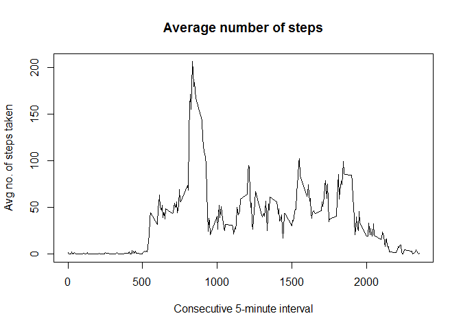

# Reproducible Research: Peer Assessment 1


## Loading and preprocessing the data

##### Load the activity data file

```r
data <- read.csv("activity.csv", header=TRUE, sep = ",")
```

##### Convert the "date" values to date format

```r
data$date <- as.Date(data$date, "%Y-%m-%d")
```

##### Show the first few rows of the dataset


```r
head(data)
```

```
##   steps       date interval
## 1    NA 2012-10-01        0
## 2    NA 2012-10-01        5
## 3    NA 2012-10-01       10
## 4    NA 2012-10-01       15
## 5    NA 2012-10-01       20
## 6    NA 2012-10-01       25
```


```r
str(data)
```

```
## 'data.frame':	17568 obs. of  3 variables:
##  $ steps   : int  NA NA NA NA NA NA NA NA NA NA ...
##  $ date    : Date, format: "2012-10-01" "2012-10-01" ...
##  $ interval: int  0 5 10 15 20 25 30 35 40 45 ...
```

## What is mean total number of steps taken per day?
##### Calculate the total number of steps taken per day

```r
aggStepsDateSum <- aggregate(steps ~ date, data, sum, na.rm=TRUE)
names(aggStepsDateSum) <- c("date", "totalSteps")
```

##### Make a histogram of the total number of steps taken each day


```r
hist(aggStepsDateSum$totalSteps, breaks=20, col="green", 
     main="Total number of steps taken each day", 
     xlab="Total number of steps")
```


##### The mean of the total number of steps taken per day


```r
mean(aggStepsDateSum$totalSteps)
```

```
## [1] 10766.19
```

##### The median of the total number of steps taken per day


```r
median(aggStepsDateSum$totalSteps)
```

```
## [1] 10765
```

## What is the average daily activity pattern?

##### Make a time series plot (i.e. type = "l") of the 5-minute interval (x-axis) and the average number of steps taken, averaged across all days (y-axis)


```r
aggStepsIntervalMean <- aggregate(steps ~ interval, data, FUN=mean, na.rm=TRUE)
names(aggStepsIntervalMean) <- c("interval", "meanSteps")

head(aggStepsIntervalMean)
```

```
##   interval meanSteps
## 1        0 1.7169811
## 2        5 0.3396226
## 3       10 0.1320755
## 4       15 0.1509434
## 5       20 0.0754717
## 6       25 2.0943396
```


```r
plot(aggStepsIntervalMean, type = "l", main="Average number of steps",
     xlab="Consecutive 5-minute interval", ylab="Avg no. of steps taken")
```



##### Find which 5-minute interval contains the maximum number of steps


```r
maxInterval <- which.max(aggStepsIntervalMean$meanSteps)
aggStepsIntervalMean$interval[maxInterval]
```

```
## [1] 835
```

## Imputing missing values

##### Calculate and report the total number of missing values in the dataset (i.e. the total number of rows with NAs)


```r
missingValues <- sum(is.na(data))
missingValues
```

```
## [1] 2304
```

##### Imputing missing values by using the mean for a given interval


```r
# copy the dataframe to imputedData
imputedData <- data

# Fills in empty step data with mean for a given interval.
for (row in which(is.na(imputedData$steps))) {
        imputedData$steps[row] <-
           as.numeric(aggStepsIntervalMean[aggStepsIntervalMean$interval ==
                                           imputedData$interval[row],]["meanSteps"])
}
```

##### Show the first few rows of imputed data. Notice that the NA values for 2012-10-01 have been replaced.

```r
head(imputedData)
```

```
##       steps       date interval
## 1 1.7169811 2012-10-01        0
## 2 0.3396226 2012-10-01        5
## 3 0.1320755 2012-10-01       10
## 4 0.1509434 2012-10-01       15
## 5 0.0754717 2012-10-01       20
## 6 2.0943396 2012-10-01       25
```

##### Check if there are anymore NA values

```r
sum(is.na(imputedData))
```

```
## [1] 0
```

##### Make a histogram of the total number of steps taken each day.


```r
aggStepDate2 <- aggregate(steps ~ date, data=imputedData, FUN=sum)
names(aggStepDate2) <- c("date", "totalSteps")

# make the histogram
hist(aggStepDate2$totalSteps, breaks=20, col="blue", main="Histogram of total number of steps per day", xlab="[Imputed] Total number of steps in a day")
```


##### Calculate and report the mean and median again. 


```r
mean(aggStepDate2$totalSteps)
```

```
## [1] 10766.19
```

##### The median of the total number of steps taken per day. 


```r
median(aggStepDate2$totalSteps)
```

```
## [1] 10766.19
```

##### Note the change in the median value compared to the value calculated before filling in the missing values, but the mean value remains the same.

## Are there differences in activity patterns between weekdays and weekends?

##### Create a new factor variable "dayType" in the dataset with two levels - "weekday" and "weekend" indicating whether a given date is a weekday or weekend day.


```r
imputedData$dayType <- as.factor(ifelse(weekdays(imputedData$date) %in%
                                    c("Saturday","Sunday"), "Weekend",
                                                            "Weekday")) 

aggStepsInt <- aggregate(steps ~ interval + dayType, data=imputedData, FUN=mean)
```

##### Make a panel plot containing a time series plot (i.e. type = "l") of the 5-minute interval (x-axis) and the average number of steps taken, averaged across all weekday days or weekend days (y-axis).


```r
library(lattice)
xyplot(steps ~ interval | dayType, aggStepsInt, type = "l", layout = c(1, 2), 
       xlab="consecutive 5-minute interval", ylab="Avg no. of steps")
```


##### As you can see, the stepping activity is more uniformly distributed during weekends. Whereas you can see the spike at around 800th minute during weekdays.
